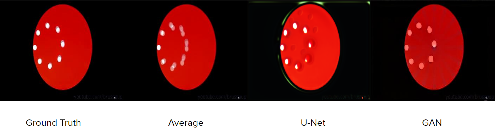
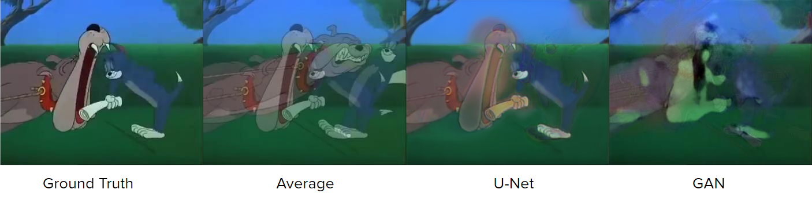
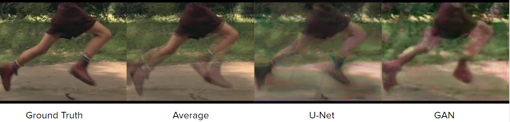

# Video Frame Rate Upscaling Using Neural Networks

## Task
Vezměte krátké 5-10 sekundové video a vytvořte generátor pro interpolování video rámců, abyste získali vysokofrekvenční zpomalené video. Používejte obě architektury: GAN a U-Net. Porovnejte výsledky.

## References
* http://www.cmlab.csie.ntu.edu.tw/~yulunliu/CyclicGen_/liu.pdf
* http://tedxiao.me/pdf/CS294_Report.pdf
* http://cs231n.stanford.edu/reports/2017/pdfs/317.pdf

## Models
* GAN
* U-Net

## Result example

